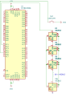

Neopixel displa( 64x WS2812B )
==============================

Zadání
------------------------------------
Animace na Neopixel dipleji x64 
- komunikace s displejem
- barevné přechody
- renderování po framech
- conways game of life
- pulzování do hudby (nedokončeno)


Komunikace s displejem
------------------------------------

```c
void init_tim(void){
    GPIO_Init(GPIOC,GPIO_PIN_1,GPIO_MODE_OUT_PP_LOW_FAST); // PC1 (TIM1_CH1)
    TIM1_TimeBaseInit(0, TIM1_COUNTERMODE_UP, 15, 0); // Upcounting, prescaler 0, dont care period/ARR value
    // OC1 as output with Polarity High in PWM2 mode (OC1N not used)
    TIM1_OC1Init(TIM1_OCMODE_PWM2, TIM1_OUTPUTSTATE_ENABLE, TIM1_OUTPUTNSTATE_DISABLE,
                 1, TIM1_OCPOLARITY_HIGH, TIM1_OCNPOLARITY_HIGH, TIM1_OCIDLESTATE_SET,
                 TIM1_OCNIDLESTATE_RESET);
    TIM1_CtrlPWMOutputs(ENABLE); // Timer output global enable
    TIM1_SelectOnePulseMode(TIM1_OPMODE_SINGLE); // Selecting One Pulse Mode
}
```
Hlavním nastavením je ` TIM1_SelectOnePulseMode(TIM1_OPMODE_SINGLE)` kteý nastavý OPM pro TIM1 a ten pak místo konstantního pulzování posílá jen pulz zapsaný v registu.

```c
void let_that_sink_in(uint32_t data[64]){

    uint8_t length = 64;
    uint32_t mask;
    disableInterrupts(); // can be omitted if interrupts do not take more then about ~25us
    while(length){   // for all bytes from input array
        length--;
        mask=0b100000000000000000000000; // for all bits in byte
        while(mask){
            while(TIM1->CR1 & TIM1_CR1_CEN); // wait if timer run (transmitting last bit)
            if(mask & data[length]){ // send pulse with coresponding length ("L" od "H")
                TIM1->ARRL = H_PULSE; // set pulse width for "H" bit
            }else{
                TIM1->ARRL = L_PULSE; // set pulse width for "L" bit
            }
            TIM1->CR1 |= TIM1_CR1_CEN; // Start timer (start single pulse generation)
            mask = mask >> 1;
        }
    }

    enableInterrupts();
}
```
Při odesílání si rozkouskuje data na jednotlivé bity a postupne podle nich zapisuje do registru pro tim1 
který na jejich zakladě generuje singlepulzy reprezentující 1/0 na onewire sběrnici pro WS2812B.
Každá led má buffer na 24bit => do ní zapisujeme barvu ve formátu  GRB `0xff00ff` každé dva digity reprezentují intenzitu jedné barvy.


Flow chart přepínání jednotlivých módů
------------------------------------


Schéma zapojení

------------------------------------



#### Animace

Všechny animace jsou v souboru [animations.c](./src/animations.c)

```c
void color_gradient_corner_effect(void) {
    uint8_t i_red = 0;
    uint8_t i_green = 0;
    uint8_t i_blue = 0;

#define speed_ms 1
#define step 2
#define red_offset -30
#define green_offset 0
#define blue_offset 0

    // hihi();
    uint32_t values[64] = {0};
    uint32_t out[64];

    for (uint8_t i = 0; i < 64; i += step) {
        values[63] =
            _merge((i + red_offset) < 0 ? 0 : (i + red_offset), 0, (127 - i));
        values[0] = _merge(
            (127 - i + red_offset) < 0 ? 0 : (127 - i + red_offset), 0, i);

        generate_diagonal_gradient(values, out);

        let_that_sink_in(out);
        if(break_flag) {
            return;
        }
        delay_ms(speed_ms);
    }
    for (uint8_t i = 64; i < 128; i += step) {

        values[63] = _merge(
            (127 - i + red_offset) < 0 ? 0 : (127 - i + red_offset), 0, i);
        values[0] =
            _merge((i + red_offset) < 0 ? 0 : (i + red_offset), 0, (127 - i));

        generate_diagonal_gradient(values, out);
        rotate90Clockwise(out);

        let_that_sink_in(out);
        if(break_flag) {

            return;
        }
        delay_ms(speed_ms);
    }
    for (uint8_t i = 0; i < 64; i += step) {

        values[63] =
            _merge((i + red_offset) < 0 ? 0 : (i + red_offset), 0, (127 - i));
        values[0] = _merge(
            (127 - i + red_offset) < 0 ? 0 : (127 - i + red_offset), 0, i);

        generate_diagonal_gradient(values, out);
        rotate90Clockwise(out);
        let_that_sink_in(out);
        if(break_flag) {

            return;
        }
        delay_ms(speed_ms);
    }
    for (uint8_t i = 64; i < 128; i += step) {

        values[63] = _merge(
            (127 - i + red_offset) < 0 ? 0 : (127 - i + red_offset), 0, i);
        values[0] =
            _merge((i + red_offset) < 0 ? 0 : (i + red_offset), 0, (127 - i));

        generate_diagonal_gradient(values, out);
        rotate90Clockwise(out);
        rotate90Clockwise(out);

        let_that_sink_in(out);
        if(break_flag) {

            return;
        }
        delay_ms(speed_ms);
    }
    for (uint8_t i = 0; i < 64; i += step) {

        values[63] =
            _merge((i + red_offset) < 0 ? 0 : (i + red_offset), 0, (127 - i));
        values[0] = _merge(
            (127 - i + red_offset) < 0 ? 0 : (127 - i + red_offset), 0, i);

        generate_diagonal_gradient(values, out);
        rotate90Clockwise(out);
        rotate90Clockwise(out);
        let_that_sink_in(out);
        if(break_flag) {

            return;
        }
        delay_ms(speed_ms);
    }
    for (uint8_t i = 64; i < 128; i += step) {

        values[63] = _merge(
            (127 - i + red_offset) < 0 ? 0 : (127 - i + red_offset), 0, i);
        values[0] =
            _merge((i + red_offset) < 0 ? 0 : (i + red_offset), 0, (127 - i));

        generate_diagonal_gradient(values, out);
        rotate90Clockwise(out);
        rotate90Clockwise(out);
        rotate90Clockwise(out);

        let_that_sink_in(out);
        if(break_flag) {

            return;
        }
        delay_ms(speed_ms);
    }
    for (uint8_t i = 0; i < 64; i += step) {

        values[63] =
            _merge((i + red_offset) < 0 ? 0 : (i + red_offset), 0, (127 - i));
        values[0] = _merge(
            (127 - i + red_offset) < 0 ? 0 : (127 - i + red_offset), 0, i);

        generate_diagonal_gradient(values, out);
        rotate90Clockwise(out);
        rotate90Clockwise(out);
        rotate90Clockwise(out);
        let_that_sink_in(out);
        if(break_flag) {

            return;
        }
        delay_ms(speed_ms);
    }
    for (uint8_t i = 64; i < 128; i += step) {

        values[63] = _merge(
            (127 - i + red_offset) < 0 ? 0 : (127 - i + red_offset), 0, i);
        values[0] =
            _merge((i + red_offset) < 0 ? 0 : (i + red_offset), 0, (127 - i));

        generate_diagonal_gradient(values, out);
        rotate90Clockwise(out);
        rotate90Clockwise(out);
        rotate90Clockwise(out);
        rotate90Clockwise(out);

        let_that_sink_in(out);
        if(break_flag) {

            return;
        }
        delay_ms(speed_ms);
    }
}
```


Závislosti
---------------

* [STM8-toolchain]([https://github.com/vdudouyt/stm8flash](https://gitlab.com/spseol/mit-no/STM8S-toolchain)


